# General Assembly (updated Post GA)

### Owlcore

This is a project started as my final General Assembly project but post bootcamp I collaborated with a fellow developer to further develop this project, this will be referenced throughout.

## Concept

The premise of my final project at GA derived from my own personal business where I wanted to build a basic booking system for clients to book and cancel fitness sessions, access a catalogue of exercises and join a community positivity board. It also required login functionality and authentication.

## Link

[Owlcore](https://eltalbot.github.io/SEB-Project-1/)

## Technology Used

The main tech stack used included React, Python and SQLAlchemy, throughout this project I also used:

- Express
- MongoDB
- Insomnia
- HTML
- CSS
- GitHub

### Python

Python was the programming language I used to build Owlcore, this was my first experience with Python.

### SQLAlchemy

I used Pythons SQL toolkit to access and manage SQL databases, this gave me the flexibility to use the Python language's own objects and not have to write separate queries.

## Time Frame

### General Assembly

The time frame given by General Assembly to complete this project was 12days, the following screenshots display the project I presented at our final assessment which was acceptable in allowing me to pass the GA bootcamp. I will reference the relevance of these images throughout the README to ensure a clear differentiation between what was completed during GA and post GA.
As a solo project at the end of 2weeks the following functionality was in place:

- Login
- Log out
- Sign up
- Browse movements
- Movement in depth
- Add movement
- Update movement
- Delete movement
- Add comment
- Delete comment
- Book session
- Cancel session

    
    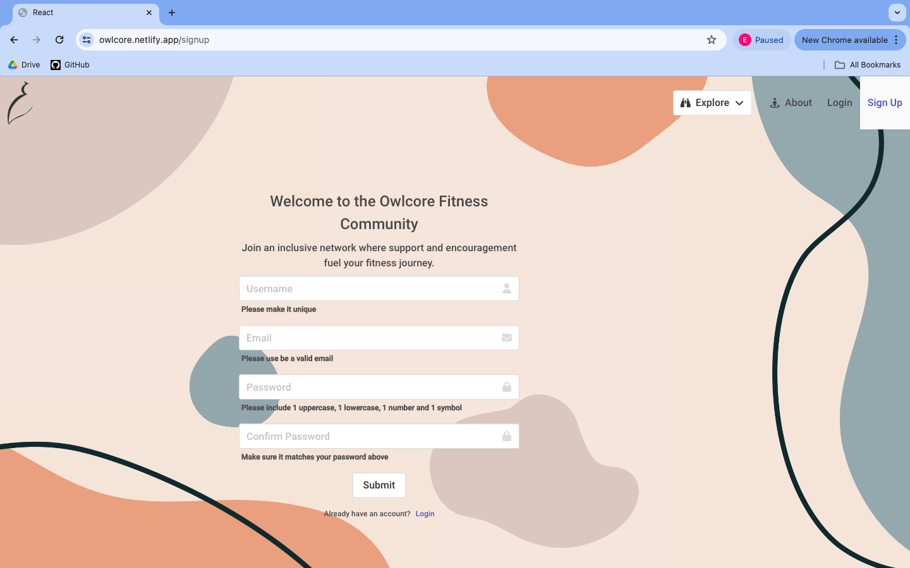

 

   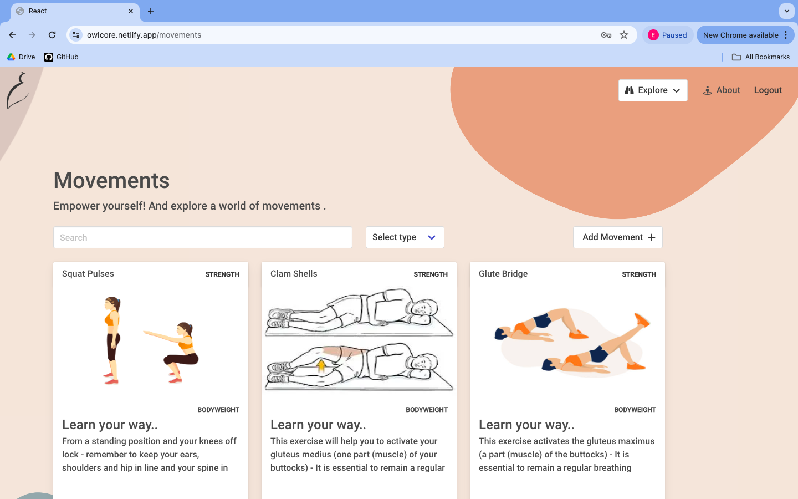
    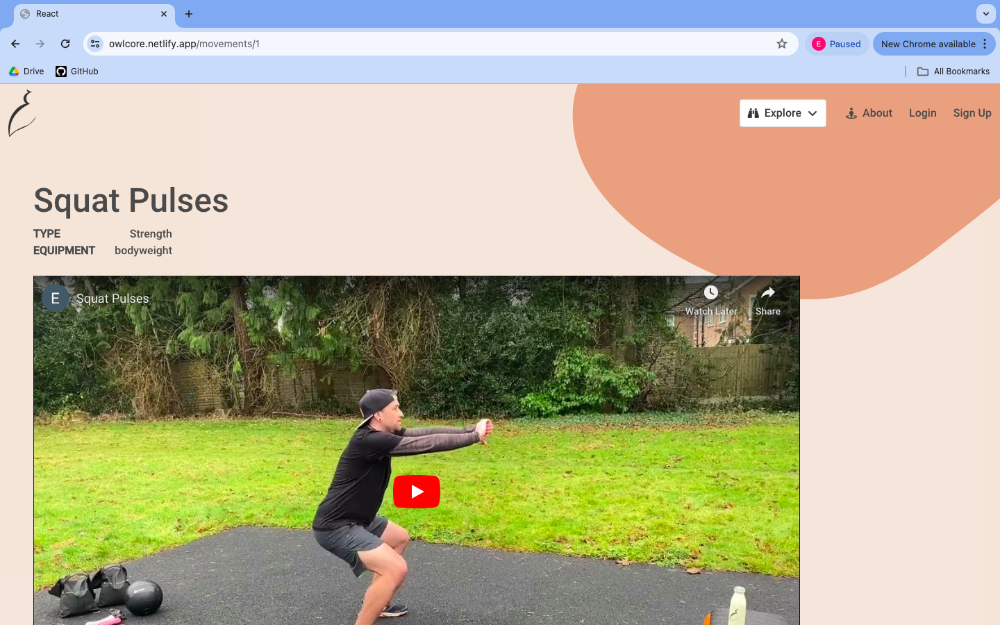

    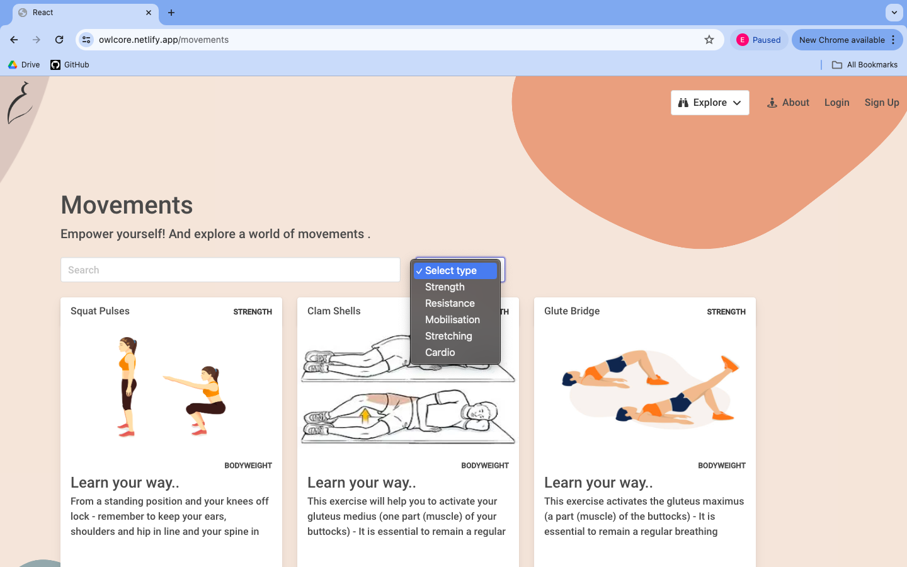
    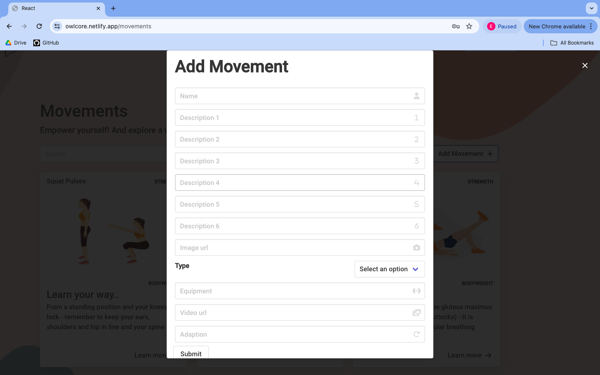

    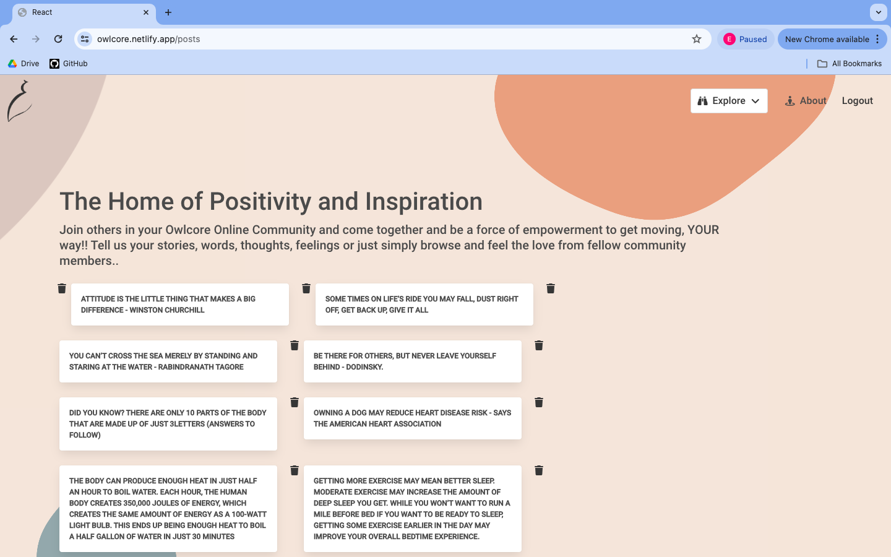
    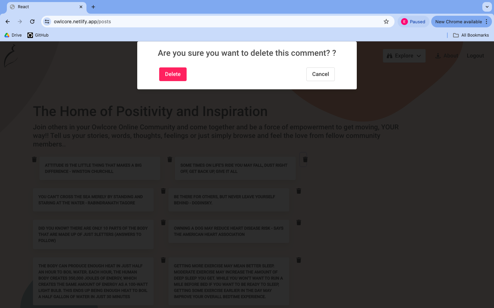

### Post GA

I wanted to build on my project and improve the UX of the site as well as add additional features.
In order to do this, I collaborated with a friend who is also a recent graduate of Brainstation Software Developer Bootcamp to build upon my project.
[Casper](https://github.com/CasperLam) spent a week focussing on the front end. In this time Casper implemented the PARQ and Consent Form Modal functionality as well as build the framework that enabled me to both learn and utilise the BEM (Block Element Modifier) methodology to manage and structure my front end.
For that week and for the following 4days I spent the time ironing out the UX as well as adding additional features including:

- A fully booked notification
- Hide and show conditional on the book/cancel buttons dependant on the users booking status on that specific session
- Implementing the backend API functionality for the PARQ and Consent Forms

## Instructional Team Brief

The brief given by the GA Instructors was:

- Build a full-stack application by making your own backend and your own front-end
- Use a Python Flask API using a Flask REST Framework to serve your data from a Postgres database
- Consume your API with a separate front-end built with React
- Be a complete product which most likely means multiple relationships and CRUD functionality for at least a couple of models
- Implement thoughtful user stories/wireframes that are significant enough to help you know which features are core MVP and which you can cut
- Have a visually impressive design to kick your portfolio up a notch and have something to wow future clients & employers. ALLOW time for this.
- Be deployed online so it's publicly accessible.

## Planning, Process and Implementation

### Planning

This being a project based on my own business, I was fortunate to have already completed a lot of the planning including the user stories, wireframes and I had dabbled with the UX due to me having already built a no code version.

A selection of my user stories can be seen here, these in particular are looking at the home page.
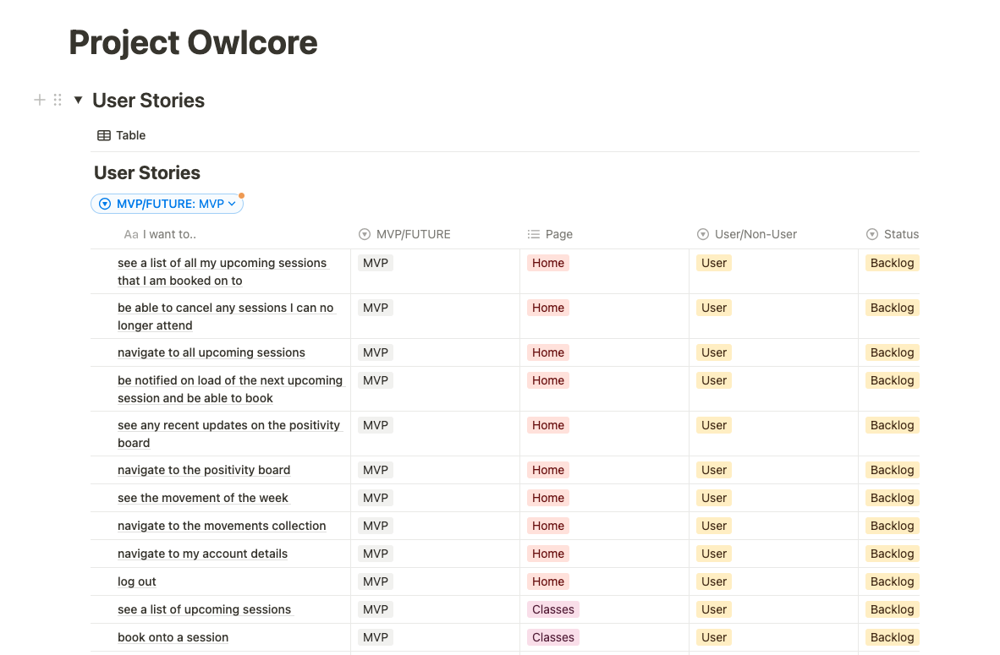

The following images display my current no code version which helped form the basis of my project including the layout but also the functionality around user navigation, authentication and UX.

    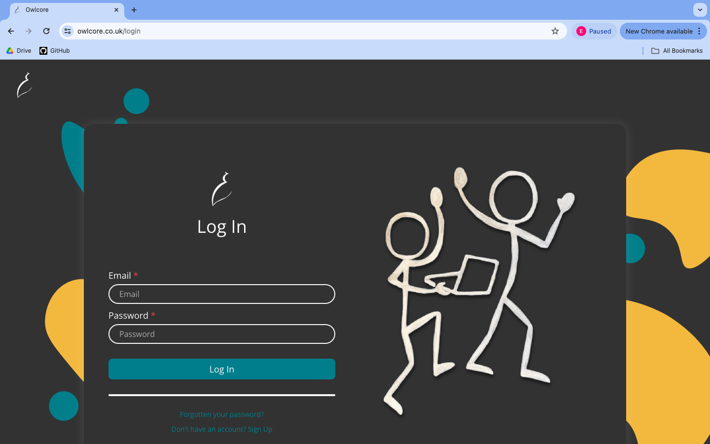
    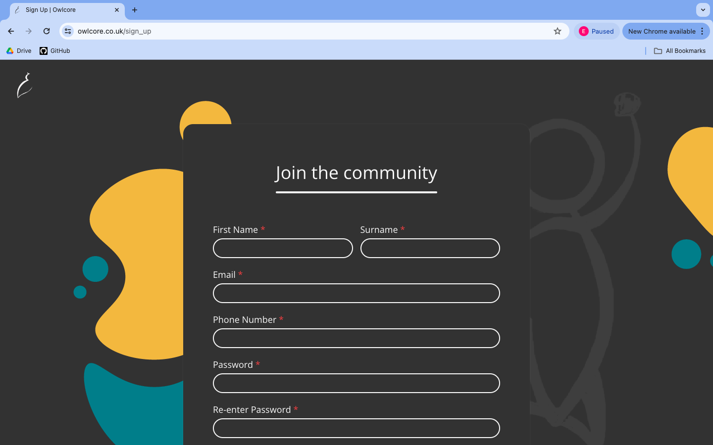
    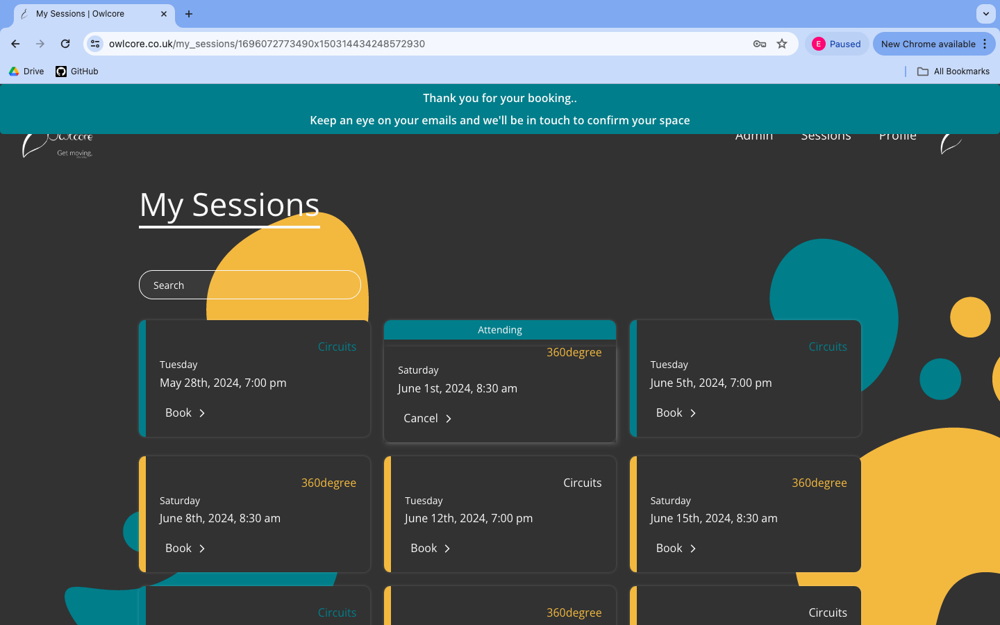

### Initial Setup

I started by creating a new repo for both the front end and back end and then installed all the necessary software and tech mentioned above.

With all the necessary tech in place I began by building the backend.

#### Backend

The screenshots below show the development of the movements component specifically.

The following components are examples of code implemented in the backend.

<ins>Models/Schemas</ins>

I created the models for each component required to build my project these being: consent, movement, parq, post, session, user_session, user - these needed to include all the necessary information that need to be present in the database as well as their relationships.
The schema defined are in place using Marshmallow (which is used to serialize and deserialize objects), in the movement example below it allows the Python objects (instances of the 'MovementModel') into a data format such as JSON, to be returned to the client in an API response. The same applies in reverse ie deserialization so the data from the client can be used to create or update database records.

<ins>Controllers</ins>

The controllers define the Flask blueprint for handling the CRUD requests using Flask routes and Marshmallow schemas for serialization.

<ins>Authentication</ins>

The secure_route is in place to authenticate users using JWT tokens for the protected Flask routes such as delete, update etc.

    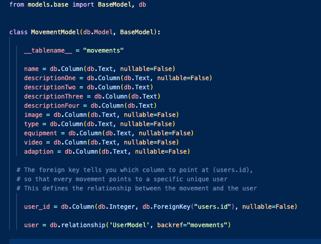
    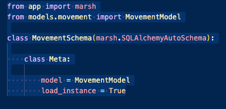
    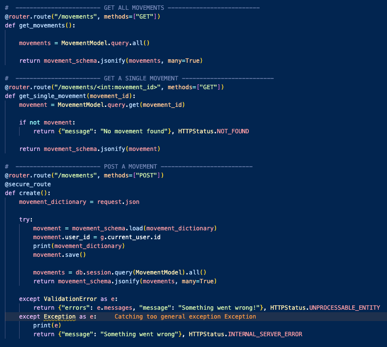
    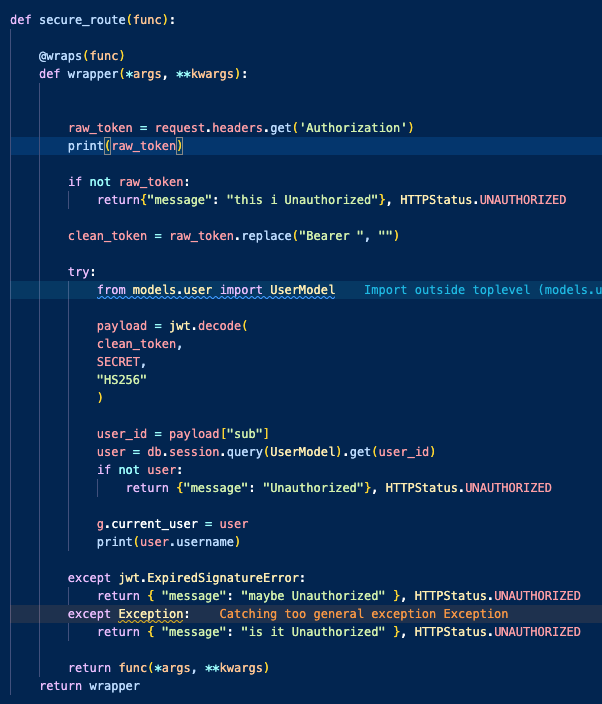

#### Frontend

The screenshots below show the development of the movements component specifically.

The following components are examples of code implemented in the frontend.

<ins>Interfaces</ins>
These are typescript interfaces that specify the structure the objects, detailing their properties and types, this is beneficial for consistency.

<ins>App.tsx</ins>
The App.tsx manages the route handling and navigation, it also implement user authentication by fetching the user data if the token (as defined in the backend `secure_route`) exists.

<ins>Components/Pages</ins>
These are built to fetch required information as well as carry out any additional requests. The examples below show the `allMovements` page that fetches all the movements, maps through each movement and passes this information to the `MovementCard` component which displays it.

    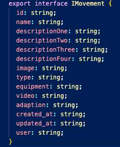
    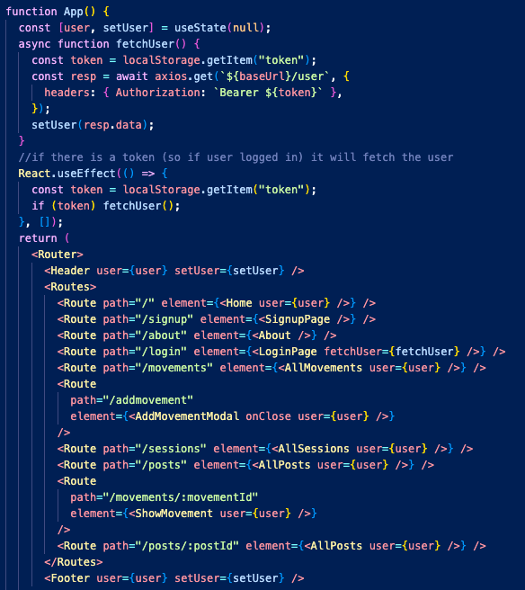

    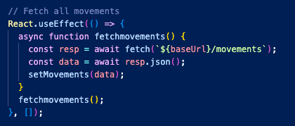
    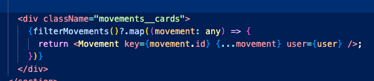
    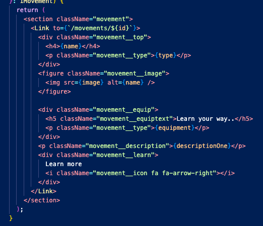

## Challenges

### Hide and Show Conditional

The biggest challenge I faced throughout was getting the backend to talk to the front end, specifically getting the book and cancel buttons to hide and show dependant on the users booking status.

Although I was able to implement the functionality for the user to book and cancel within the backend which can be seen using Insomnia (as seen below), I was unable to implement the hide and show book and cancel conditionals dependant on the users booking status.

    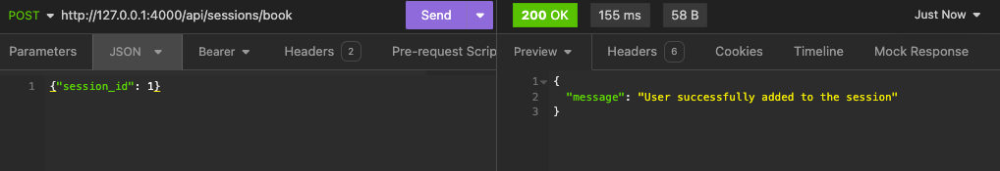
    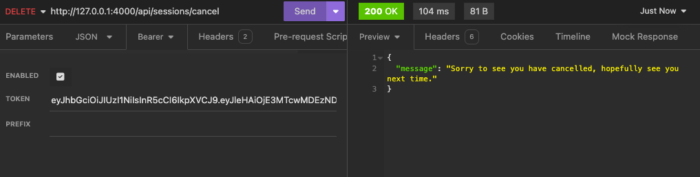

However, this was successfully implemented post GA (see below), this was made more complicated as the buttons were being displayed on the `sessionCard` component not the `sessions` page.

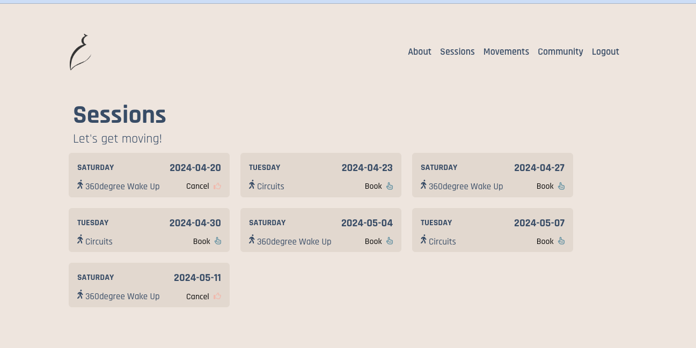

This meant that I had to pass the function that either "booked" or "cancelled" the user from a session onto the session card as a prop, which could then be called when the button is clicked, this then allowed the conditional render (show or hide) accordingly.

    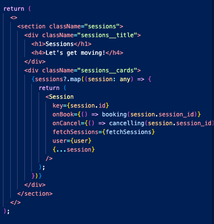
    

In addition to this was the need to not only render all the sessions but to render all the sessions with the users booking status attached. To do this I had to update the session model in the backend to include a `user_booked()` function which gets the `current_user.id` and filters through the sessions and returns the sessions that has that `current_user.id` in the database as "booked".

This is then called within the `get` sessions request, which subsequently returns and passes to the front end and renders the sessions accordingly (see below).

    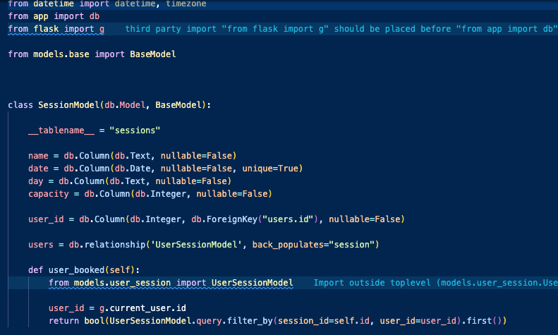
    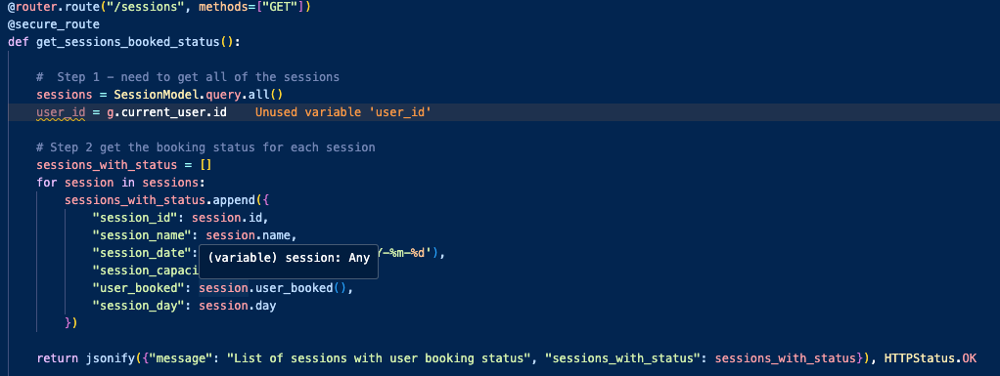

### Fully Booked Function

Another feature I wanted to include is the ability to notify the users when a session reached its capacity and was fully booked, this subsequently prevents the user from being able to book (by hiding both the book and cancel buttons)

This was a learning curve for me and allowed me to explore code I hadn't experienced before. The screenshot below is the function that enables this feature. To help me understand it and therefore implement it I broke it down took each step independantly.

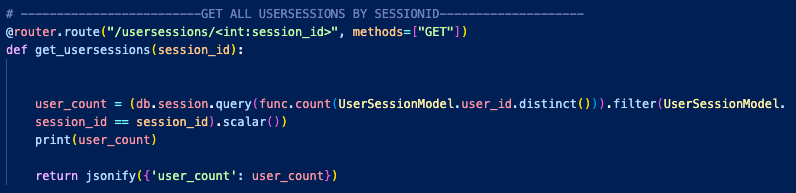

#### Understanding the code

<ins>Backend</ins>

For me to understand the code I tried to break it down into steps:

1. `@router.route("/usersessions/<int:session_id>", methods=["GET"])`
   This defines the route that accepts a "GET" request, the `<int:session_id>` is passed as a parameter to the route handler function.
2. The route handler function `def get_usersessions(session_id):` takes the session_id and handles the requests to that specified route.
3. The following code queries the database using SQLAlchemy `user_count = (db.session.query(func.count(UserSessionModel.user_id.distinct())).filter(UserSessionModel.session_id == session_id).scalar())`

- `db.session.query` starts thequery using SQLAlchemy.
- `(func.count(UserSessionModel.user_id.distinct()))` counts all of the distinct `user_id` values in the usersession model database.
- `.filter(UserSessionModel.session_id == session_id)` this filters the query to only include the sessions where the `session_id` matches the `session_id` provided in the parameter.
- `.scalar()` returns a scalar value (the count of user IDs for a given session ID).

4. `return jsonify({'user_count': user_count})`this returns the user_count to the client and `jsonify`converts the dictionary into a JSON response

<ins>Front end</ins>

This request is called here in the front end (see below) using `React.useEffect()`. Using the session capacity field within the sessions database, the userCount defined here as well as the `user_booked` prop I was able to display a "Fully Booked" tag and hide the book/cancel buttons accordingly.

    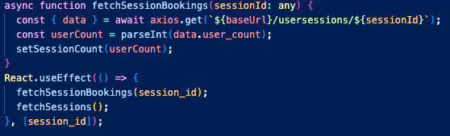
    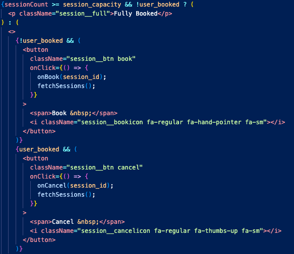

## Wins

### BEM - Block Element Modifier

My pre-collaborative version of my project that can be seen at the beginning of this README used a CSS framework Bulma for its layout and design. Although this gave me a foundation and a responsive design, on collaborating with Casper I was introduced to BEM (Block Element Modifier).

Post GA and collaborating with Casper meant he was able to spend time building the framework within my front end enabling me to learn and incorporate this methodology throughout my code.

The BEM methodology and having the ability to create reusable components I feel meant there was a more uniformed approach within my code allowing for a more consistent design across my project. It also gave me more control over the layout and design, subsequently facilitating a better UX experience.

An example of this framework can be seen below - every page or component has its own `.scss` page that defined its layout but in a logical format. As can be seen here the `.show` block is the main block that has style applied that effect the entire "show" section, the `&__title` for example is the element, by using the `&` symbol refers to the parent selector `.show` so logically the `&__title` is `.show__title` which then has styles applied to it.

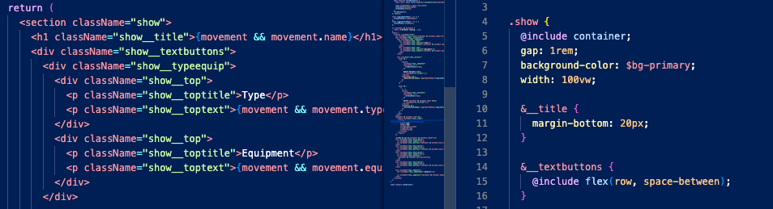

The benefits of using BEM has meant that my code follows a far more organised approach and helps keep the class names understandable, readable and more organised by indicating the relationship between different parts of the code. Having the opportunity to learn this methodology from Casper was a big win for me.

## Key Learnings/Takeaways

### Time Management/Realistic MVP

My main takeaway from my final project is time management and the importance of setting a realistic MVP with the given timeframe.

Although I managed to achieve the necessary requirements to graduate successfully from GA, it was apparent within a couple days that my initial MVP may have been a little ambitious.

My initial MVP saw me achieving what can be seen in the screenshots at the top but additional features including:

- A community page where the users can talk and post comments but managed by an admin, this also required a delete, update function however, only the user who wrote the post can delete/update it.
- Within this community I wanted there to be the possibility that the users could comment on each others comments and create a mini 'thread or feed' below that comment.

With the knowledge that I would be writing code unfamiliar to me as well as using a SQL Relational Database specifically, many to many relationships that was required to enable the booking/cancelling feature, I would have allowed more time for this learning curve as I was unable to spend more time on the community feature.

### Collaboration

Having the opportunity to collaborate post GA was an extremely positive experience for me. I was not only able to further my grasp on Git but mainly I was exposed to new methodology (BEM) that has transformed the way I approach CSS for the better.

## Bugs

### Show and Hide Conditional

The conditional in place is designed to render a ‘book’ or ‘cancel’ button dependant on their booking status for that specific session in the database. Initially the only way this happened was after a page refresh, this creates poor UX as it can lead to confusion as to whether the user has booked/cancelled.

The useEffect in place fetched all the sessions the current user is booked on, which was then used to render to correct button. However, this happening on page load meant on clicking the ‘book’ button and calling the ‘book a session’ function and not the ‘get all the sessions the current user is booked on’ function (which happens on page load) meant the correct button was not being rendered on a button click.

To fix this bug, the function to fetch all the sessions the user is booked on needed to be called during the book a session function to allow the conditional to render the correct button. The screenshot below shows the `fetchSessions()` function defined on the sessions page, which is then passed as a prop to the sessionCard component to then be called on the button click of a user booking/cancelling thus updating the status of the users booking status.

    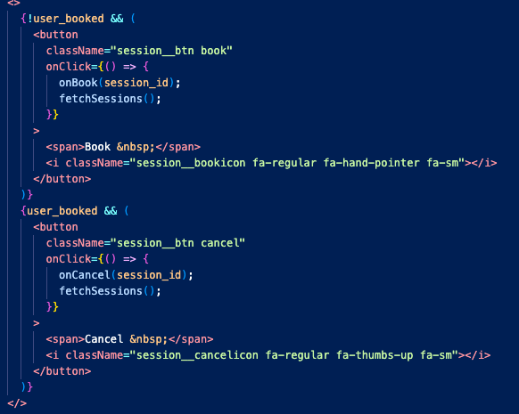
    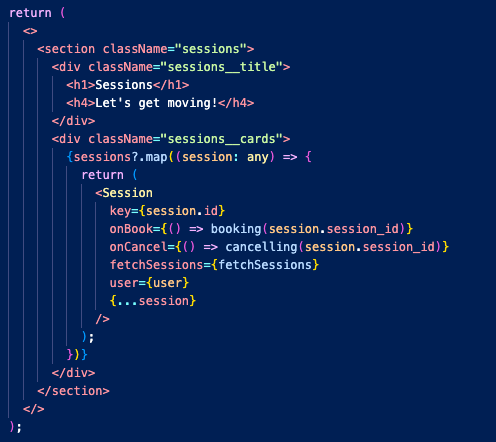

## Future Improvements

This for me was always going to be an ever evolving project, although right now it functionally performs how I need it to there are many additional features I would like to add as well as develop upon.

The following are just a few examples of these features:

1. Community - I desperately want to provide a safe space online where people can come to talk and get inspiration and support from other like-minded people in terms of physical well-being. I currently have a positivity board implemented but would like to spend time building this safe online community, requirements would be:
   The user being able to:

- add a comment
- delete THEIR OWN comment
- update THEIR OWN comment
- start a feed under someone elses comment
- like a comment
  The most important part of this feature is the security and authentication aspects as it needs to be a space for positivity and support and needs to ensure that the users feel safe which is why time spent on this feature is essential.

2. Payment - a big feature I would like to add is the ability for the user to pay for the fitness session when booking, the implementation of platforms such as stripe is required and any user interaction with payment details and sensitive data needs to be taken seriously.

3. Favourited Movements - I would like for the users to be able create their own catalogue of movements that they can access at ease, having the opportunity to build this from the movements provided but being able to personlise it for themselves and maybe start to build it into their own routine.
